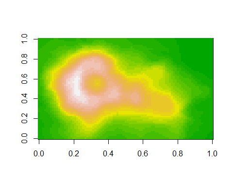

# BLOSC 

<!-- badges: start -->

[](https://github.com/pepijn-devries/blosc/actions/workflows/R-CMD-check.yaml)
<!-- badges: end -->

*Status: experimental*. A package that ports BLOSC compressors and
decompressors to R.

## Installation

You can install the development version of blosc from
[GitHub](https://github.com/) with:

``` r
# install.packages("pak")
pak::pak("pepijn-devries/blosc")
```

MacOS users may first need to install system requirements before
installing the package using:

``` r
source("https://mac.R-project.org/bin/install.R")
install.libs("blosc")
```

## Example

The blosc package can be uesd to compress `raw` data, but also vectors
of other data types. The example below shows how data from the volcano
matrix can be compressed with blosc.

``` r
library(blosc)

volcano_compressed <-
  blosc_compress(volcano, typesize = 2L, dtype = "<f2")

object.size(volcano_compressed)
#> 6312 bytes
object.size(volcano)
#> 42672 bytes
```

Note that 16 bit floating (`<f2`) point numbers are used for the
compression which are much less precise than R’s native 64 bit floating
point numbers. Nonetheless, in this particular case the precision is
sufficient to restore the volcano data.

``` r
volcano_reconstructed <-
  matrix(
    blosc_decompress(volcano_compressed, dtype = "<f2"),
    nrow(volcano),
    ncol(volcano)
  )

image(volcano_reconstructed, col = terrain.colors(24L))
```



## Acknowledgements

Big thanks to Simon Urbanek for assisting with setting up the MacOS
config.

## Code of Conduct

Please note that the blosc project is released with a [Contributor Code
of
Conduct](https://contributor-covenant.org/version/2/1/CODE_OF_CONDUCT.html).
By contributing to this project, you agree to abide by its terms.
