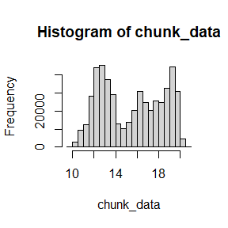

# blosc

<!-- badges: start -->

[](https://github.com/pepijn-devries/blosc/actions/workflows/R-CMD-check.yaml)
<!-- badges: end -->

Currently only an experimental package. It is meant to port BLOSC
compressors and decompressors to R.

## Installation

You can install the development version of blosc from
[GitHub](https://github.com/) with:

``` r
# install.packages("pak")
pak::pak("pepijn-devries/blosc")
```

## Example

TODO

``` r
chunk_dat <-
  "https://s3.waw3-1.cloudferro.com/mdl-arco-geo-014/arco/GLOBAL_ANALYSISFORECAST_PHY_001_024/cmems_mod_glo_phy_anfc_0.083deg_PT1H-m_202406/geoChunked.zarr/thetao/8.0.99.137" |>
  httr2::request() |>
  httr2::req_perform() |>
  httr2::resp_body_raw()

## decompress downloaded data:
chunk_decomp <- blosc:::blosc_decompress(chunk_dat)
## recompress it:
chunk_recomp <- blosc:::blosc_compress(chunk_decomp, 9, 2, 4)
#> Out size 1185889

zarray <-
  "https://s3.waw3-1.cloudferro.com/mdl-arco-geo-014/arco/GLOBAL_ANALYSISFORECAST_PHY_001_024/cmems_mod_glo_phy_anfc_0.083deg_PT1H-m_202406/geoChunked.zarr/thetao/.zarray" |>
  httr2::request() |>
  httr2::req_perform() |>
  httr2::resp_body_json(check_type = FALSE)

## decode zarr dtype to R types
chunk_data <- blosc:::dtype_to_r(chunk_decomp, "<f4", zarray$fill_value)
hist(chunk_data)
```


